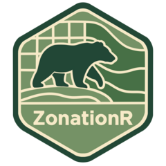

<!-- README.md is generated from README.Rmd. Please edit that file -->

```{r, include = FALSE}
knitr::opts_chunk$set(
  collapse = TRUE,
  comment = "#>",
  fig.path = "man/figures/README-",
  out.width = "100%"
)
```

# ZonationR <a href="https://thiago-cav.github.io/ZonationR/"></a>

<!-- badges: start -->
[](https://www.gnu.org/licenses/gpl-3.0)  
[](https://github.com/thiago-cav/ZonationR/actions/workflows/R-CMD-check.yaml)
[](https://app.codecov.io/gh/thiago-cav/ZonationR)
<!-- badges: end -->


### Overview

*ZonationR* is an R package that provides a seamless interface to the Zonation software, enabling users to execute spatial conservation prioritization workflows directly from R.  

The package is designed to:

* **Support learning and teaching** by lowering the entry barrier for R users exploring Zonation.  
* **Streamline workflows** by automating input preparation, execution, and post-processing.  
* **Enable reproducibility** through transparent script-based workflows that remains fully consistent with the original Zonation software.


Traditionally, Zonation workflows require manual input preparation, running the software via GUI or command line, and separate post-processing in R or GIS. *ZonationR* simplifies this process by integrating all steps into R, enabling transparent and automated workflows.


### Features

- Automated generation of Zonation input files from R.  
- Execution of Zonation 5 directly from R scripts.  
- Post-processing of Zonation outputs, including raster maps and summary tables.  
- Support for reproducible teaching examples and research workflows.  


### Installation

You can install ZonationR from CRAN:
```{r, eval=F}
install.packages("ZonationR")
```

Or install the development version from GitHub:
```{r, eval=F}
# Install pak if not already installed
if (!requireNamespace("pak", quietly = TRUE)) {
  install.packages("pak")
}

# Install ZonationR from GitHub
pak::pak("thiago-cav/ZonationR")
```

Load the package:
```{r, eval=F}
library(ZonationR)
```


### Getting help

If you find a clear bug, please open an issue with a minimal reproducible example on **[GitHub](https://github.com/thiago-cav/ZonationR/issues)**. 

### Contributing

Contributions of any kind are warmly welcomed! These can include improvements to the documentation, `testthat` tests, vignettes, or new functions. If you have an idea for a new feature, please reach out so we can discuss it.

Pull requests to the `master` branch need confirmation and a code review from the package maintainers. We recommend using the **[pull request helpers](https://usethis.r-lib.org/articles/pr-functions.html)** from the *usethis* package, which are part of our workflow.

We also use GitHub Actions for continuous integration, so please make sure the package passes `R CMD check` without errors or warnings before submitting a pull request.

### Documentation

For detailed documentation, tutorials, and example workflows, see the **[ZonationR website](https://thiago-cav.github.io/ZonationR/)**.
