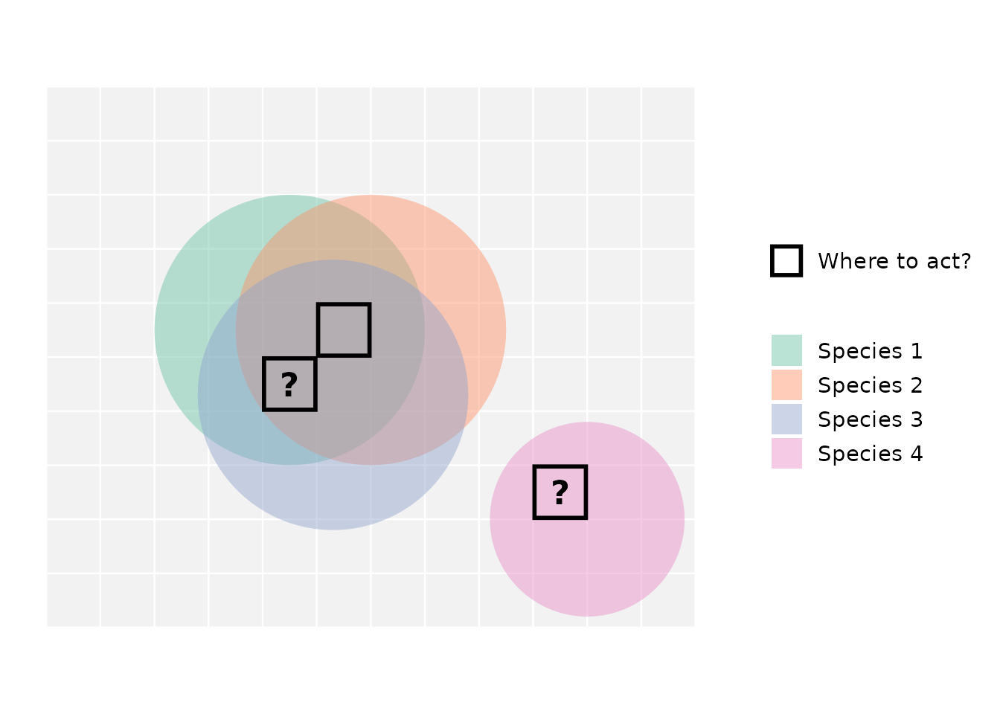
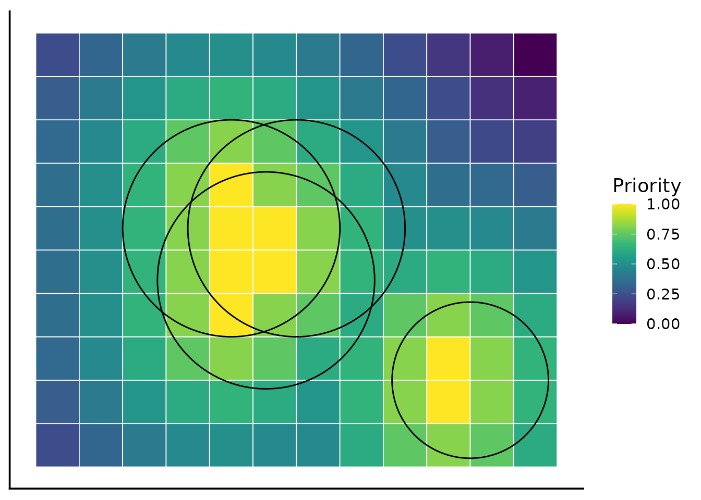

# Why spatial conservation prioritization?

This vignette introduces spatial conservation prioritization, a powerful
approach for deciding **where** conservation actions matter most.

### The geography of conservation decisions

Spatial conservation decisions are ultimately decisions about **where to
act.** Even when conservation goals are global, the real impact happens
in specific places, whether it’s a forest, a coral reef, a river basin,
or a broader landscape. Because space is finite, conservation always
involves **making choices**.

> Protecting one area usually means not protecting another, at least not
> immediately or to the same extent.

This simple yet crucial reality shapes modern conservation planning
because:

- **Biodiversity is unevenly distributed** across the globe.
- **Threats vary spatially**, affecting some areas more than others.
- **Resources are limited**, creating competition among different land
  uses and priorities.

Therefore, conservation operates under constraints such as:

- Limited budgets,
- Conflicting land uses,
- Multiple objectives that cannot all be maximized simultaneously.

These constraints are **not failures**, they are the **starting point**
for effective, strategic conservation planning.

The figure illustrates a common conservation dilemma. Three species
overlap in the central area, creating a location with high biodiversity
value, while a fourth species occurs in isolation. When conservation
action is limited to only a few places, should we prioritize areas that
protect many species at once, or areas that are critical for a species
found nowhere else?

> Consider the black-outlined cells and the question marks: if we can
> only select two locations for protection, which one would you pick as
> the second? Why might choosing only two out of the three candidate
> locations be challenging?

Choosing where to act inevitably involves navigating difficult
trade-offs.

------------------------------------------------------------------------

### From spatial patterns to decision challenges

Over the past decades, conservation science has made enormous progress
in data availability. Species distribution models, habitat maps, remote
sensing products, and global biodiversity databases are now more
accessible than ever. However, conservation planners are often
challenged by the **difficulty of turning complex, sometimes incomplete
data into clear decisions**. A common first approach is to layer maps on
top of one another to visualize species richness, threat levels, or
habitat extent. While informative, this rarely leads to clear choices.

When multiple features are considered simultaneously, **conflicts
emerge**:

- Areas important for one species may be less important for another.
- Regions with high biodiversity value may overlap with areas of intense
  human use.

This often leads to a familiar frustration:

> *“I have all the information I need — so why is deciding still so
> hard?”*

The problem lies not in the data alone, but in the **lack of a
structured way to resolve trade-offs across space**.

### Moving beyond yes or no: The need to prioritize

Many conservation decisions are often seen as simple **binary choices**:
protect or not protect, include or exclude. But in reality, conservation
planning rarely works this way. Decisions are usually **incremental**,
i.e. actions happen over time, budgets change, and priorities evolve as
new information becomes available. In this dynamic context,
**flexibility is key**.

Instead of asking *“Should this area be protected?”* planners often need
to ask:

- **Which areas matter more?**
- **Which actions should happen first?**
- **If only part of a landscape can be addressed now, where should we
  start?**

This shift from **selection** to **prioritization** fundamentally
changes the problem.The goal is no longer to find a single “best”
solution, but to support **informed decisions** that work under
uncertainty and constraints.

> Understanding this shift helps planners make smarter choices that
> adapt to real-world challenges.

------------------------------------------------------------------------

### Ordering space by importance

Spatial conservation prioritization offers a structured way to deal with
complex trade-offs by **ordering space according to relative
importance**. Instead of dividing the world into “protected” and
“unprotected” areas, prioritization produces a **continuous ranking**.
Every location receives a value that reflects how much it contributes to
overall conservation goals.

This approach changes how we think about conservation decisions:

- Areas are no longer simply selected or rejected.
- Their importance is understood **relative to the rest of the
  landscape**.
- Decisions can adapt to different budget levels or policy scenarios.

Importantly, a place is not valuable in isolation. Spatial conservation
prioritization evaluates its contribution through well-established
theoretical principles:

1.  **Complementarity** — how well a location adds value to the existing
    network.  
2.  **Representation** — how many biodiversity features it supports.  
3.  **Irreplaceability** — how difficult it would be to substitute
    elsewhere.

Because the result is a ranking rather than a fixed boundary, planners
can ask:

> What if we protect the top 10% of the landscape?  
> What changes if we expand protection to 20%?  
> Where do trade-offs become most visible?

This figure shows how the species distributions illustrated earlier
could hypothetically translate into a continuous priority map. The color
gradient reflects relative conservation importance, with bright yellow
cells representing the highest-priority locations. Peaks occur both in
areas of high species richness and in locations critical for unique
species, reflecting the principles of complementarity and
irreplaceability in spatial prioritization.

------------------------------------------------------------------------

### Zonation as a practical implementation

Spatial conservation prioritization requires methods that can
systematically compare locations while accounting for multiple
biodiversity features. **Zonation** is one such method. Zonation
produces a **hierarchical ranking of the landscape**, from the most to
the least valuable areas for conservation. Rather than selecting sites
one by one, it progressively removes the least valuable areas, revealing
which locations remain most important as the landscape is reduced.

This process allows Zonation to:

- **Consider multiple biodiversity features at once**,  
- **Evaluate areas based on how they complement each other**,  
- **Highlight trade-offs clearly and transparently**.

Because the ranking is continuous, it supports flexible decision-making.

> In this way, Zonation turns complex spatial data into structured,
> defensible conservation guidance.

------------------------------------------------------------------------

### How the ZonationR package fits in

The ZonationR package is designed to support the use of Zonation within
R workflows. It is important to clarify what it does, and what it does
not do.

**What it does not do:**

- Replace the Zonation software  
- Modify the underlying prioritization algorithm

**What it helps you do:**

- Prepare and structure input data  
- Run and manage analyses from R  
- Organize outputs in reproducible workflows

By bringing Zonation into R, the package makes it easier to develop
transparent analytical pipelines, teach spatial conservation
prioritization, and document every step of the decision process.

------------------------------------------------------------------------

### Additional resources

For readers interested in more detailed discussions of the topics
covered:

- **Core concepts in systematic conservation planning** [Kukkala et al.,
  2013](https://onlinelibrary.wiley.com/doi/full/10.1111/brv.12008)

- **Trade-offs between different prioritization approaches** [Cavalcante
  et al.,
  2025](https://www.sciencedirect.com/science/article/pii/S0006320725004057)

- **Zonation 5 algorithm details** [Moilanen et al.,
  2021](https://besjournals.onlinelibrary.wiley.com/doi/full/10.1111/2041-210X.13819)
